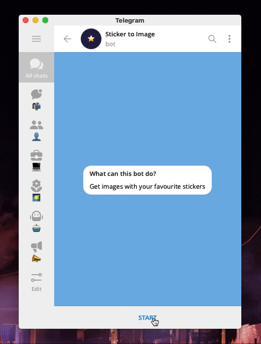

# @stimagebot

Get a link to image for Telegram sticker.

[](//t.me/stimagebot)

Now you can easily add stickers to your comments on GitHub :wink:

```markdown

```

## Development

Clone a repository.

```shell
git clone https://github.com/codex-team/stimagebot
cd stimagebot
```

Create a config file and enter a token of your bot into this config.

```shell
cp config.sample.js config.js
```

Then you can use docker or yarn to run the bot.

### Docker

Run the container.

```shell
docker-compose up
```

It will install all node deps and run the code.

### Yarn

Install Node.js packages.

```shell
yarn
```

Then run the bot.

```shell
yarn start
```

Or for dev need for auto restart app on changes.

```shell
yarn start:dev
```
